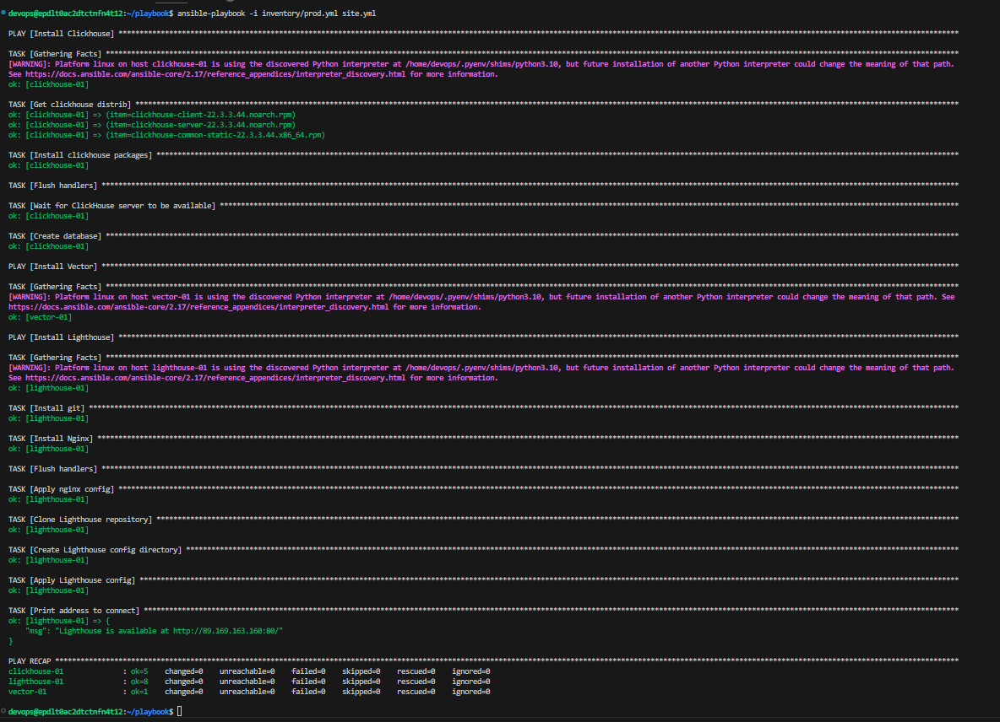
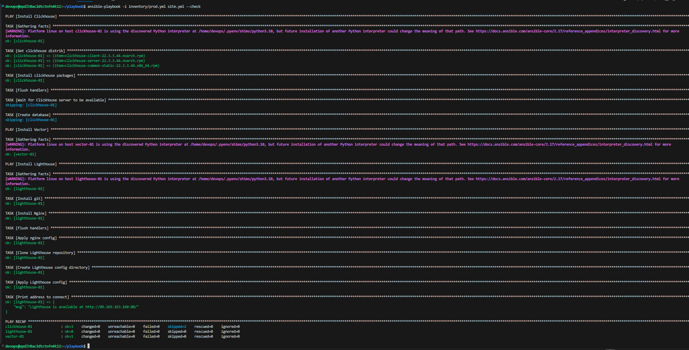
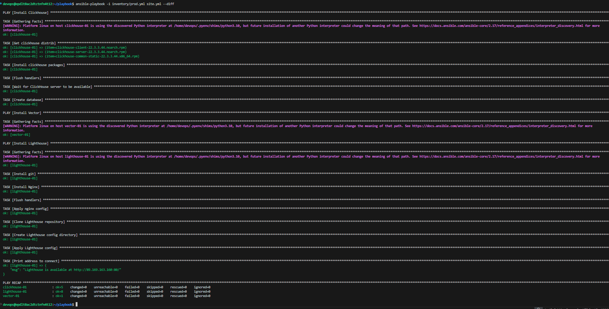
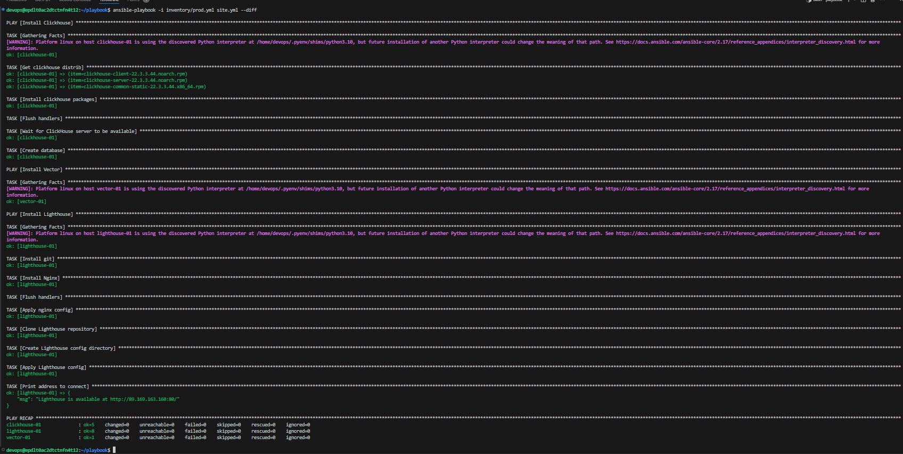

# Домашнее задание к занятию 3 «Использование Ansible» - Филатов А. В.

## Подготовка к выполнению

1. Подготовьте в Yandex Cloud три хоста: для `clickhouse`, для `vector` и для `lighthouse`.
2. Репозиторий LightHouse находится [по ссылке](https://github.com/VKCOM/lighthouse).

## Основная часть

1. Допишите playbook: нужно сделать ещё один play, который устанавливает и настраивает LightHouse.
2. При создании tasks рекомендую использовать модули: `get_url`, `template`, `yum`, `apt`.
3. Tasks должны: скачать статику LightHouse, установить Nginx или любой другой веб-сервер, настроить его конфиг для открытия LightHouse, запустить веб-сервер.
4. Подготовьте свой inventory-файл `prod.yml`.
5. Запустите `ansible-lint site.yml` и исправьте ошибки, если они есть.
6. Попробуйте запустить playbook на этом окружении с флагом `--check`.
7. Запустите playbook на `prod.yml` окружении с флагом `--diff`. Убедитесь, что изменения на системе произведены.
8. Повторно запустите playbook с флагом `--diff` и убедитесь, что playbook идемпотентен.
9. Подготовьте README.md-файл по своему playbook. В нём должно быть описано: что делает playbook, какие у него есть параметры и теги.
10. Готовый playbook выложите в свой репозиторий, поставьте тег `08-ansible-03-yandex` на фиксирующий коммит, в ответ предоставьте ссылку на него.

---

### Как оформить решение задания

Выполненное домашнее задание пришлите в виде ссылки на .md-файл в вашем репозитории.

---
## Решение

* site.yml  
```
---
- name: Install Clickhouse
  hosts: clickhouse
  handlers:
    - name: Start clickhouse service
      become: true
      ansible.builtin.service:
        name: clickhouse-server
        state: restarted

  tasks:
    - name: Get clickhouse distrib
      ansible.builtin.get_url:
        url: "https://packages.clickhouse.com/rpm/stable/{{ item }}"
        dest: "/tmp/{{ item }}"
      loop: "{{ clickhouse_packages }}"

    - name: Install clickhouse packages
      become: true
      ansible.builtin.yum:
        name:
          - "/tmp/clickhouse-client-{{ clickhouse_version }}.noarch.rpm"
          - "/tmp/clickhouse-server-{{ clickhouse_version }}.noarch.rpm"
          - "/tmp/clickhouse-common-static-{{ clickhouse_version }}.x86_64.rpm"
        validate_certs: no
        disable_gpg_check: yes
      notify: Start clickhouse service

    - name: Flush handlers
      meta: flush_handlers

    - name: Wait for ClickHouse server to be available
      ansible.builtin.wait_for:
        port: 9000
        delay: 10
        timeout: 300

    - name: Create database
      ansible.builtin.command: "clickhouse-client -q 'create database logs;'"
      register: create_db
      failed_when: create_db.rc != 0 and create_db.rc != 82
      changed_when: create_db.rc == 0

- name: Install Vector
  hosts: vector
  handlers:
    - name: Start Vector service
      become: true
      ansible.builtin.service:
        name: Vector
        state: restarted

    - name: Get Vector package
      become: true
      ansible.builtin.get_url:
        url: "https://yum.vector.dev/stable/vector-0/{{ vector_arch }}/vector-{{ vector_version }}-1.{{ vector_arch }}.rpm"
        dest: "/tmp/vector-{{ vector_version }}-1.{{ vector_arch }}.rpm"

    - name: Install Vector package
      become: true
      ansible.builtin.yum:
        name: "/tmp/vector-{{ vector_version }}-1.{{ vector_arch }}.rpm"
        validate_certs: no
        disable_gpg_check: yes

    - name: Create Vector configuration directory
      become: true
      ansible.builtin.file:
        path: /etc/vector
        state: directory
        mode: '0755'

    - name: Deploy Vector configuration
      become: true
      ansible.builtin.template:
        src: templates/vector.toml.j2
        dest: /etc/vector/vector.toml
        mode: '0644'

    - name: Start Vector service
      become: true
      ansible.builtin.service:
        name: vector
        state: started
        enabled: true

- name: Install Lighthouse
  hosts: lighthouse
  handlers:
    - name: Start-nginx
      become: true
      ansible.builtin.service:
        name: nginx
        state: started
    - name: Reload-nginx
      become: true
      ansible.builtin.service:
        name: nginx
        state: reloaded
  pre_tasks:
    - name: Install git
      become: true
      ansible.builtin.yum:
        name: git
        state: present
  tasks:
    - name: Install Nginx
      become: true
      ansible.builtin.yum:
        name: nginx
        state: present
      notify: Start-nginx
    - name: Flush handlers
      ansible.builtin.meta: flush_handlers

    - name: Apply nginx config
      become: true
      ansible.builtin.template:
        src: templates/nginx.conf.j2
        dest: /etc/nginx/nginx.conf
        mode: "0644"
      notify: Reload-nginx

    - name: Clone Lighthouse repository
      become: true
      ansible.builtin.git:
        repo: "{{ lighthouse_vcs }}"
        version: master
        dest: "{{ lighthouse_local_dir }}"

    - name: Create Lighthouse config directory
      become: true
      ansible.builtin.file:
        path: /etc/nginx/conf.d
        state: directory
        mode: "0755"

    - name: Apply Lighthouse config
      become: true
      ansible.builtin.template:
        src: templates/lighthouse.conf.j2
        dest: /etc/nginx/conf.d/default.conf
        mode: "0644"
      notify: Reload-nginx

    - name: Print address to connect
      ansible.builtin.debug:
        msg: "Lighthouse is available at http://{{ ansible_host }}:{{ lighthouse_port }}/"

```
Добавил отдельные переменные для каждого хоста, изменил prod.yml

1. 

2. 

3. 

4. 
